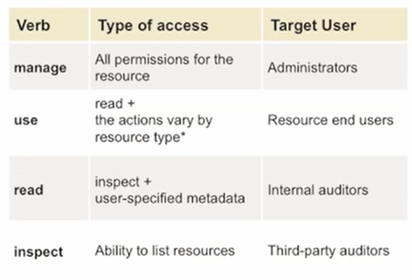
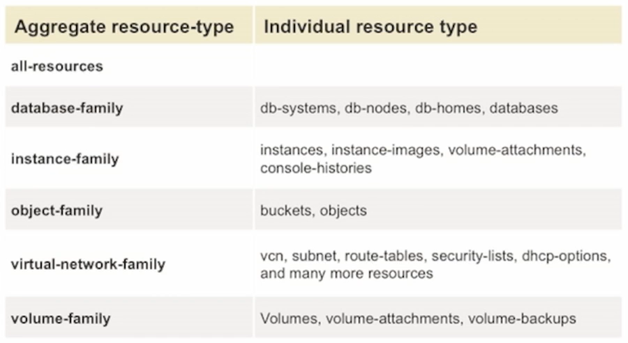

# AuthN and AuthZ

A **principal** is an IAM entity that is allowed to interact with OCI resources. 

There are two kinds of principals primarily in OCI:
- IAM Users
- Principal Resources

## Authentication (AuthN)

Authentication is basically figuring out: are you who you say you are? 

There are different ways to do authentication:
- username and password
- API signing keys
- auth tokens

## Authorization (AuthZ)

Authorization deals with permissions and figuring out what permissions do you have.

In OCI, authorization is done through what we call as **policies**. Policies are human readable statements to define granular permissions. Policies can be attached to a compartment, or they could be attached to a tenancy. 

NOTE. Everything is denied by default.

E.g.

    Allow group <group_name> to <verb> <resource_type> in <location> [where <conditions>]

### Policies Verbs

### Policies Resource Types

