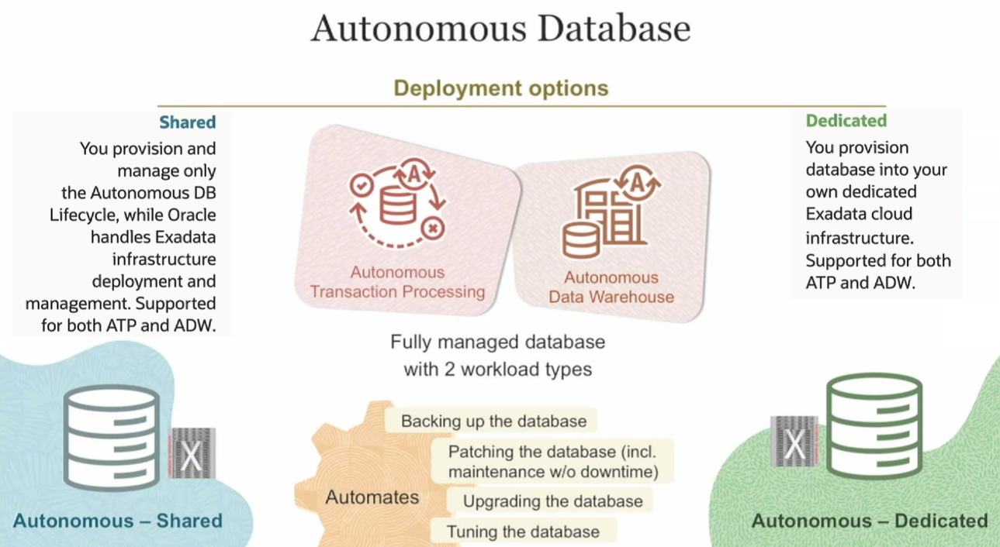
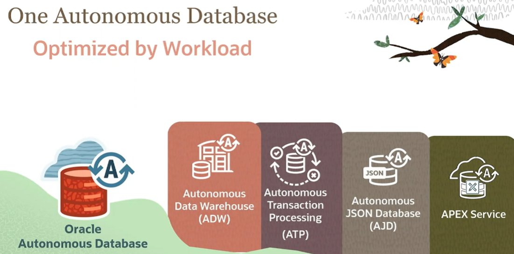

# Autonomous Database

Autonomous Database is a cloud database that uses machine learning to automate database tuning, security, backups, updates, and other routine management tasks, traditionally performed by DBAs.

So the idea is, as much as you can automate and let your users focus on differentiated higher level tasks, the better it is because they don't have to get involved with a lot of manual tasks and repetitive tasks. They don't have to do these because some of these tasks are also *error prone*. So using technologies like machine learning, we can take that out from the equation, let them focus on the value, additive, higher level differentiated tasks.

The **self-driving feature** of Oracle Autonomous Database enables automatic database optimizations without manual intervention. It uses machine learning and automation to perform tasks such as provisioning, patching, tuning, and backup, which helps reduce the need for manual database administration and maintenance.

The **self-repairing feature** of Oracle Autonomous Database ensures automatic database recovery in case of failures. It detects and corrects issues in the database infrastructure, including hardware, software, and human errors, helping to maintain high availability and protect against data loss.

The **self-securing feature** of Oracle Cloud Infrastructure Autonomous Database provides automatic application of security patches and protection from threats. It ensures that the database is always up-to-date with the latest security updates, helping to safeguard your data and maintain a strong security posture.

Autonomous Database supports two database/workload types:
1. **Autonomous Transaction Processing (ATP)**: this is for your OLTP,  so think about transactions. 
2. **Autonomous Data Warehouse (ADW)**: this is for online analytical processing. 

But there are two other workload types:
1. **Autonomous JSON Database**: it is an ATP but designed for developing NoSQL-style applications that use the JSON documents
2. **APEX Service**: it is geared towards developers who are building low code APEX applications

