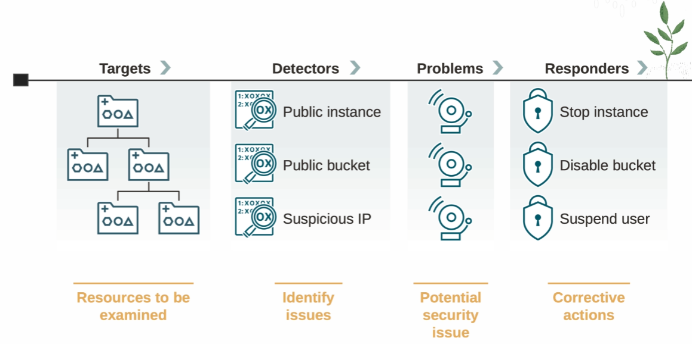
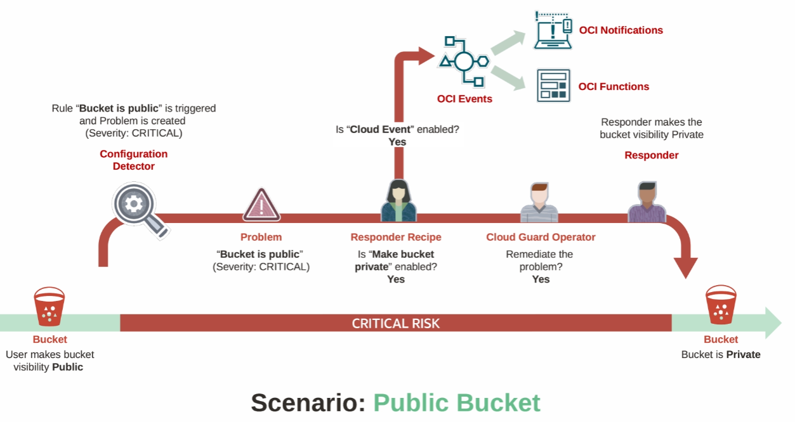

#  Oracle Cloud Guard

Cloud Guard is a service that falls under the category of *Cloud Security Posture Management*. It helps to monitor and identify potential security issues and then remediate them. What is really interesting about Cloud Guard is that it can completely automate the remediation.

## How does it works ?

1. Targets: resources to be examined
2. Detectors:  identified issues
3. Problems: potential security issues
4. Responders: corrective actions

## Example Scenario

The scenario here is a public bucket, and you don't want this bucket to be public. You want this to be a private bucket because that aligns with your security posture.

