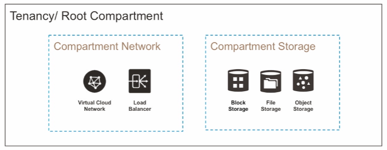
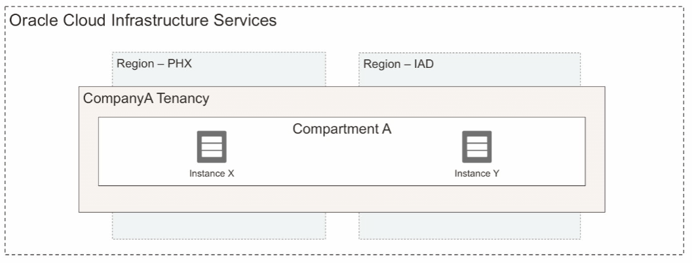

# Oracle Cloud Infrastructure Compartments

When you open an account in OCI, you get a **tenancy** (fancy name for an account) and a **root compartment**.

A root compartment is a logical construct where to keep all cloud resources. Inside a root compartment you can create specific compartments for isolation and controlling access. All compartments you create are global, and they are available in every region you have access to.

NOTE. The best practice is to create dedicated compartments to isolate resource.

Key Features:
- each resource belongs to a single compartment
- resources can interact with other resources in different compartments
- resources can be moved from one compartment to another
- resources from multiple regions can be in the same compartment
- compartments can also be nested (six levels nesting)
- you could set quotas and budgets on compartments

