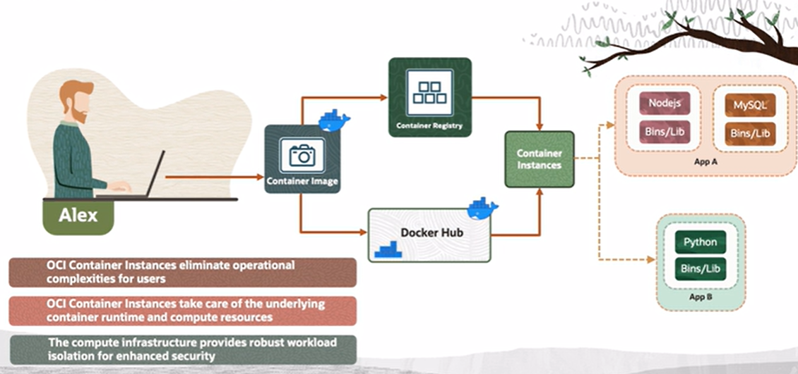

# Container Instances

OCI has a capability called OCI Container Instances. 

These container instances offer the quickest and most straightforward way to launch containers without the need to handle virtual machines or adopt more advanced services like OKE. By eliminating the operational complexity, OCI Container Instances enable users to run containerized applications without having to manage any infrastructures. User only need to supply the container image for their applications and OCI takes care of the underlying container runtime and compute resources.

You can specify environment variables, resource limits, startup options, etc. for each container. And you can even run multiple containers on one container instances. The containers are hosted on fully-managed compute infrastructure that is specifically designed for container workloads, providing robust workload isolation for enhanced security. 

Think of container instances as a serverless offering where you can run containers without really worrying about the underlying infrastructure.

