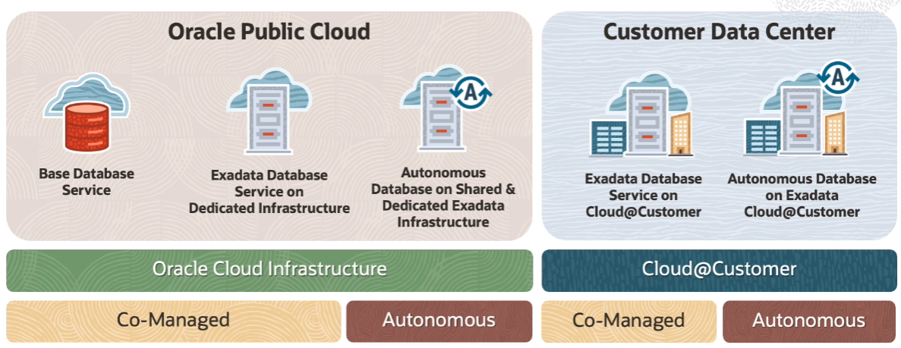

# Database Introduction

## Autonomous Database

Autonomous Database is the world's first autonomous data management service in the cloud which delivers automated patching, upgrades, and tuning while the system is running, without any human intervention. So this database is self-managing, self-securing, and self-repairing, which helps to eliminate manual database management and human errors.

Autonomous Database comes in two flavors:
1. **Shared Exadata Infrastructure**: you provision and manage only the autonomous database, while Oracle deploys and manages all the underlying infrastructure
2. **Dedicated Exadata Infrastructure**: OCI gives you a completely dedicated compute, storage, network, and database service just for you, just for a single benefit

## Cloud@Customer

Cloud@Customer enables you to meet your company's demanding regulatory requirements, data residency requirements, and application latency requirements, while at the same time, you can leverage all the benefits of database services running in OCI Public Cloud.

