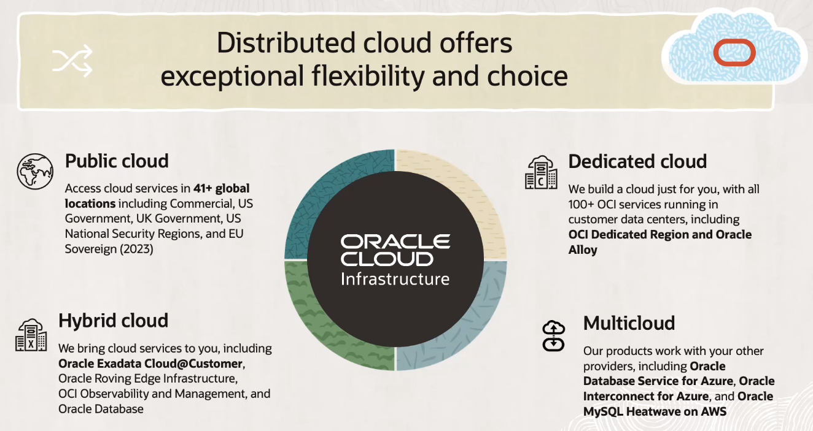
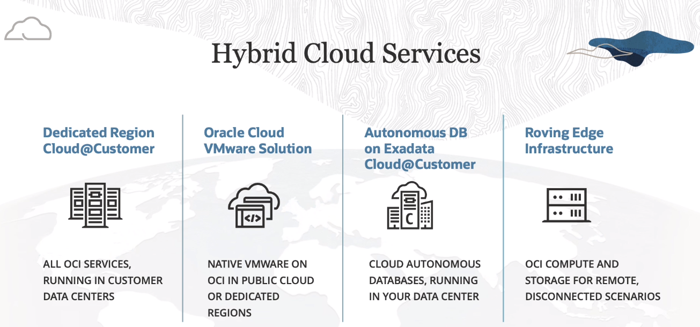
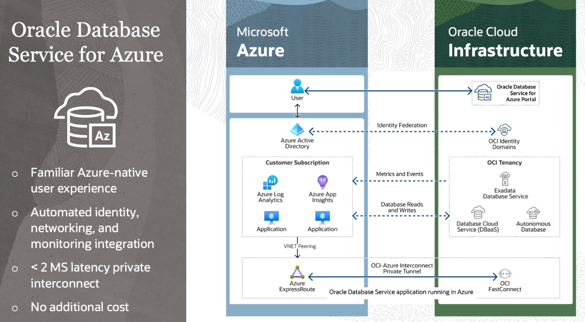

# Oracle Distributed Cloud

Customers can get Oracle services through:
- Public Cloud
- Hybrid Cloud
- Dedicated Cloud
- Multicloud

## Hybrid Cloud 

1. **Dedicated Region Cloud@Customer**: all OCI services, running in customer data centers.

2. **Oracle Cloud VMware Solution**: native VMware on OCI in Public Cloud or Dedicated Regions.

3. **Autonomous DB on Exadata Cloud@Customer**: cloud Autonomous Database running in your data center.

4. **Roving Edge Infrastructure**: OCI compute and storage for remote disconnected scenarios.

## Multicloud

- Familiar Azure-native user experience
- Automated dentity, networking, and monitoring integration
- Less than 2ms latency private interconnect
- No additional cost

