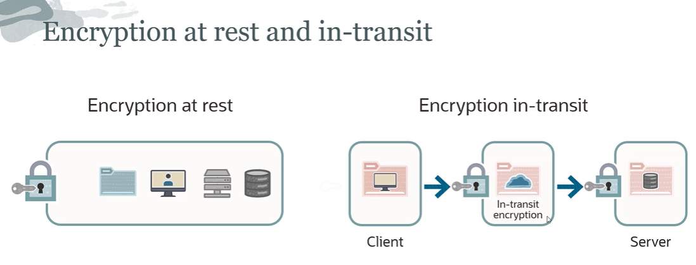

# Encryption Basics

Encryption is used to transform plain text data into cipher text (also referred to as encrypted text).

## At-Rest vs In-Transit

**Encryption at rest** ensures that the data (stored on a physical device, such as a server, etc.) is unreadable without the keys needed to decrypt it. So if an attacker obtained a hard drive with encrypted data and didn't have access to the encryption keys, they would be unable to read that data. 

**Encryption in transit** is basically data moving from one location to another, such as across the internet or through a private network. You can do in-transit encryption so that the data is secure. So HTTPS is an example of encryption in transit. Encrypting data in transit basically protects it from outside attackers and provides a mechanism to transmit data while limiting the risk of exposure.

## Simmetric vs Asimmetric

Symmetric-key cryptography is where a **single key** is used for encryption and decryption.

Asymmetric encryption is where different keys are used for encryption and decryption. A key pair (private/public) is generated with a specific algorithm to be used for encryption (i.e. digital signing).

## Encryption Algorithms

**AES (Advanced Encryption Standard)** algorithm: the same key encrypts and decrypts data. It **cannot** be used for digital signing.

**RSA (Rivest–Shamir–Adleman)** algorithm: the public key encrypts data and the private key decrypt data. It can be used for digital signing. RSA is computationally more intensive, and it's a bit slower.

**ECDSA (Elliptic Curve Digital Signature Algorithm)**: keys are generated by elliptic curve cryptography that is smaller than the average keys generated by digital signing algorithms. It's one of the more complex public key cryptography encryption algorithms. Can be used **only** for digital signing, not for encryption and decryption of data.

## Hardware Security Module (HSM)

Hardware Security Module is a physical computing device that safeguards and manages keys. 

HSM has unique characteristics:
- it is tamper-evident
- it is used to manage digital keys
- it performs cryptographic functions

HSMs are typically certified to internationally recognized standards, such as Common Criteria or FIPS 140, to provide users with independent assurance that the design and implementation of the product and cryptographic algorithms are sound.

Oracle Cloud Infrastructure provides a service called **Vault** that uses HSM behind the scenes. The HSMs it uses meet the FIPS 140-2 Security Level 3 certification (maximum is 4).

