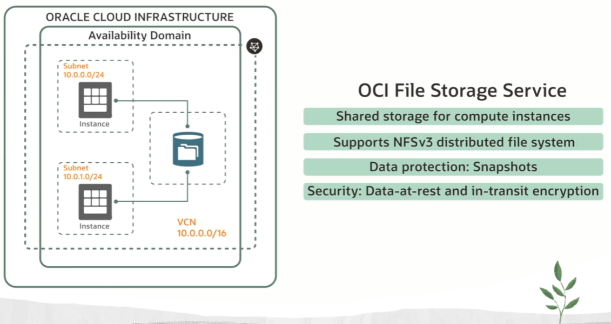

# File Storage

File storage is hierarchical collection of documents organized into name directories.

The OCI File Storage service uses the Network File System (NFS) protocol for file access. NFS allows clients to access files over a network in a manner that appears as though they are part of the local file system.

The two most common distributed file systems are:
- network file system (NFS) for Linux
- server messaging block (SMB) for Windows

Both the protocols and the standards are supported by Unix and Windows.

File Storage Use Cases:
- EBS (E-Business Suite)
- General Purpose File Systems
- Microservices and Containers
- HPCs scale-out apps
- Analytics

