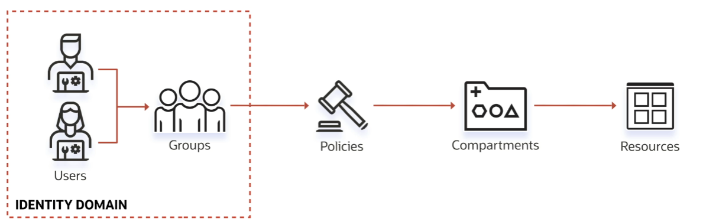
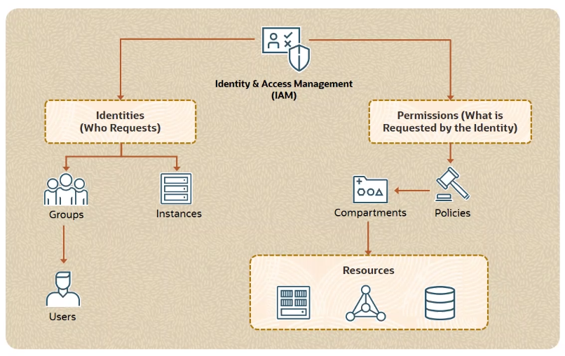

# Oracle Cloud Infrastructure IAM

IAM stands for **Identity and Access Management service**.** 

It's also sometimes referred to as:
- **Fine-Grained Access Control**
- **Role-Based Access Control**

There are two key aspects to this service:
- **Authentication (AuthN)**: has to deal with identity (who someone is)
- **Authorization (AuthZ)**: has to deal with permission (what someone is allowed to do)

## Identity Domains

An Identity Domain is a container for users and groups.

How does it works ?
1. Create an Identity Doamin
2. Create Users and Groups
3. Write Policies against those groups
4. Policies are scoped to a tenancy/account/compartment
5. Resource area available within a compartment

Each resource in the OCI has its own assigned identifier, which is called **Oracle Cloud ID (OCID)**. Oracle generates these unique identifiers.

The syntax is:

    ocid1.<resource_type>.<realm>.[region][.future_use].<unique_id>

where:

- *realm* is basically set of regions that share the same characteristics (e.g. commercial, government, etc.)
- *resource_type* is kind of the type of the resource (e.g. compute instance, block storage, etc.)
- *region* is the region code
- *unique_id* is the unique identifier of the resource

Examples:

    [Tenancy] ocid1.tenancy.oc1..aaaaartg56hjrtyu84556fdfdtqu56 (NOTE: no region!)
    [Block Volume] ocid1.volume.oc1.eu-frankfurt-1.dsarhsd456hfd98fkajh45as

