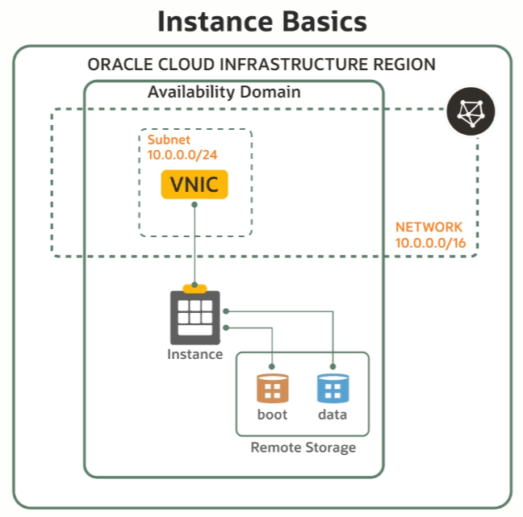

# Instance Basics

An instance is a compute host and it has several dependencies.

## Live Migrate

There is one more feature which is really relevant when you are talking about compute instances, and that's live migration. We know that computers fail all the time. So how do we make sure that whatever compute host you are running is always up and running, itself? So we have this feature called **Live Migrate**. And the idea here is if one of the compute hosts goes down, there's a problem, we would migrate your VM to another host in our data center, and it will be transparent to you. There are multiple options you provide (whether opt-in or opt-out) you can choose from. But the idea is we migrate your virtual machines so you can live-migrate between hosts without rebooting. This keeps your applications running even during maintenance events. To achieve this in your own data centers is a not-so-trivial task, but we make that seamless within OCI.