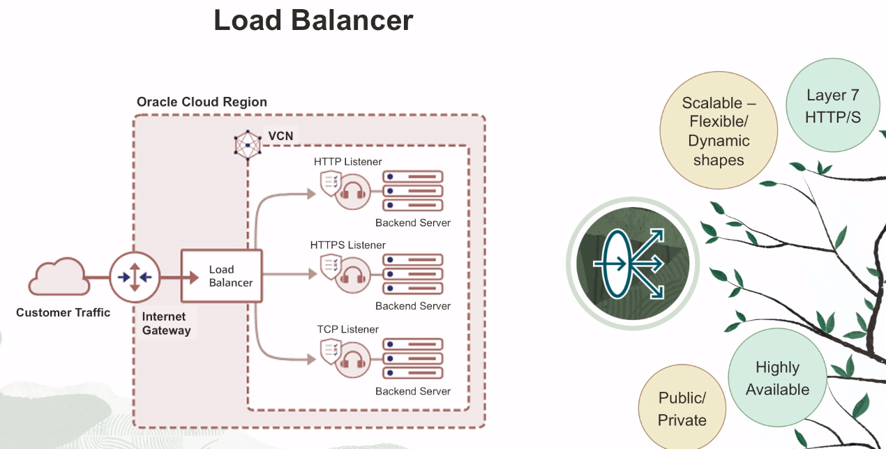
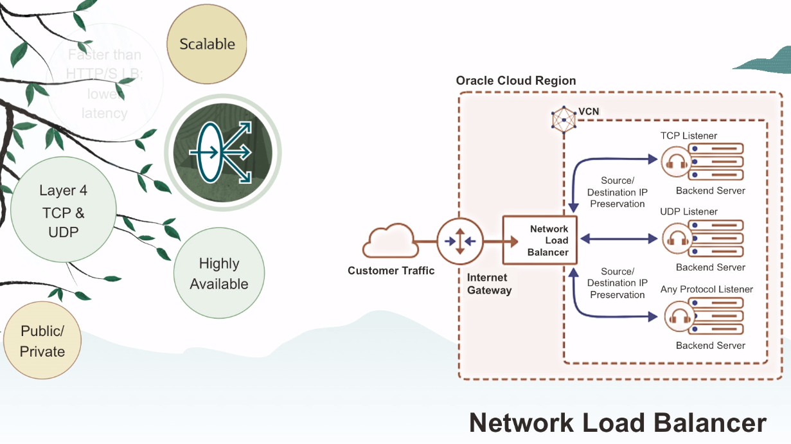

# Load Balancer

A **Load Balancer** allows you to achieve *high availability* and *high scalability*. They are also referred to as **Reverse Proxies**.

## HTTP/S (Layer 7) Load Balancer 

The first type of Load Balancer in OCI is a **HTTP/S (Layer 7) Load Balancer**. Layer 7 basically means it understands HTTP and HTTPS. That's the OSI model.

The Load Balancer comes in two different shapes:
- **flexible shape**: you define the minimum and the maximum and you define the range.
- **dynamic shape**: you predefine the shapes (micro, small, medium, large). You don't have to warm up your Load Balancer. If the traffic comes to that particular shape, the Load Balancer automatically scales.

The Load Balancer can be:
- **public**: it is available on the web.
- **private**: it means your multiple tiers, like a web tier, can talk to your database tier and balance the traffic between them, but both tiers don't have to be public.

## Network (Layer 4) Load Balancer 

The second type of Load Balancer in OCI is called **Network (Layer 4) Load Balancer**. And as the name specify, Network Load Balancer operates at layer 4, layer 3, and layer 4 so it understands TCP, UDP, also supports ICMP.

Like HTTP Load Balancer, it has both public and a private option.

## HTTP/S Load Balancer vs Network Load Balancer

Why would you use Network Load Balancer or a HTTP Load Balancer? 

The primary reason you would use it is it's much faster than HTTP Load Balancer. It has much lower latency. So if performance is a key criteria for you, go with Network Load Balancer. On the contrary, the HTTP Load Balancer has higher level intelligence because it can look at the packets, it can inspect the packets, and it gets that intelligence. So if you're looking for that kind of routing intelligence, then go with HTTP Load Balancer.