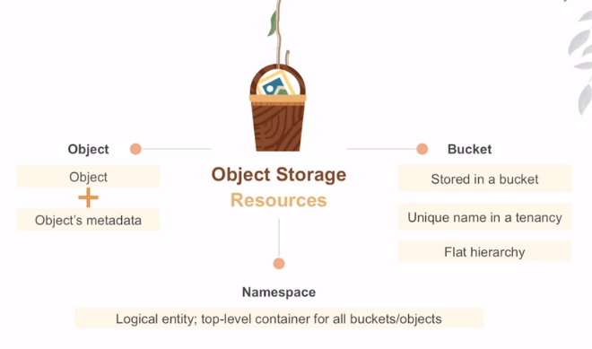
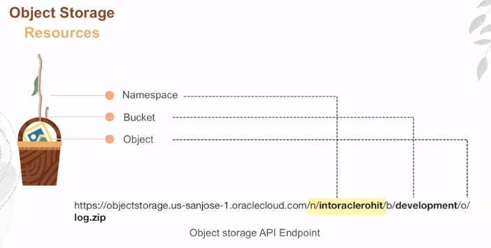

# Object Storage

OCI Object Storage characteristics:
- internet-scale, high-performance storage platform
- data is managed as objects
- ideal for unstructured data
- regional, public service
- multiple storage tiers
- private access from OCI resources (e.g. compute)
- advanced capabilities

OCI Object Storage scenarios:
- content repository
- unstructured and semi-structured data
- big data scenario (Sparck, Hadoop, Data Analytics)
- archive/backups

## How does it works ?

Anything you store in object storage is referenced as **object**. Think about object as *key-value pairs* or *name-value pairs*, name being the name of the file your storing and the value being the actual value of the file. And then objects can also have **object metadata** snd you could define your own metadata there.

Objects are stored in a **bucket** and the buckets have your unique name within the tenancy. Important thing to keep in mind is there is a *flat hierarchy*. And anytime you see a folder structure, that's simulated by the object storage service by using something called *prefixes*.

There's also something called **namespace**. Namespace is a logical entity. It's a top-level container for all buckets object. And it has to have a globally unique name.

## Object Storage Tiers

1. **Standard Tier** (also called *Hot Tier*)
    - critical data
    - fast, immediate and frequent access
    - most recent copy of the data
    - instantaneous retrieval
    - can't be downgraded
2. **Infrequent Access** (also called *Cool Tier*)
    - critical data
    - ideal for data that you access infrequently (e.g. backups)
    - storage cost lower than the Standard Storage Tier (60% cheaper)
    - minimum retention required (31 days)
    - retrieval fees
3. **Archive Tier** (also called *Cold Tier*)
    - seldom or rarely accessed data (e.g. tape storage)
    - minimum retention required (90 days)
    - objects need to be restored before download
    - restore time: 1 hour
    - download time: 24 hours
    - archive bucket can't be upgraded

## Auto-Tiering

There is a feature called **auto-tiering** that looks at your access pattern and can move the data from standard tier to infrequent access tier and vise versa. 

## Lifecycle Management

It helps you transition the data from higher cost tiers to the lower cost tiers. So you could say after 30 days, move my data from standard tiers to archive tiers, and delete them after 180 days. And you write a rule. And the service takes care of that.

## Versioning

You can also do versioning because as you are storing your data, you can have multiple versions of that data. And these objects are automatically versioned. You just specify that on the bucket and OCI take care of that.

## Data Encryption

It's very important because you're storing sensitive data in the Cloud. So we give you data encryption **by default**. You cannot turn this off. You can always bring your own keys for very stringent requirements. You have that option.

## Access Data

Object storage is a public service, you access them using a public **API endpoint**.

    https://<region>.oraclecloud.com/n/<namespace>/b/<bucket>/o/log.zip

    /n = namespace
    /b = bucket
    /o = object  

