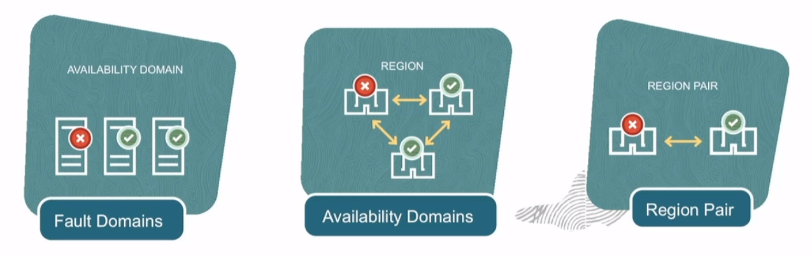

# Oracle Cloud Infrastructure Architecture

Core constructs of OCI's Physical Architecture:
- **Regions**: localized geographic area comprising of one or more Availability Domains. 
- **Availability Domains (AD)**: fault-tolerant data centers located within a region but connected to each other by a low latency, high bandwidth network.
- **Fault Domains (FD)**: grouping of hardware and infrastructure within an availability domain to provide antiaffinity (i.e. *logical data center*).

An OCI region is composed of one or more isolated, interconnected availability domains. Each availability domain is a separate physical location within a region. The number of availability domains per region may vary; some OCI regions have three availability domains, while some others have a single availability domain.

Fault domains provide a capability to protect your applications and instances from unexpected hardware failures or network outages within an availability domain. They provide anti-affinity: Each fault domain runs on its own set of physical hardware, so a failure that impacts one fault domain does not affect instances in other fault domains.

A fault domain is a subdivision of an availability domain. Each availability domain contains three fault domains. Fault domains let you distribute your instances so that they are not on the same physical hardware within a single availability domain. A fault domain cannot be associated with multiple availability domains.

## How do you choose a Region ?

1. **Location**: the region closest to your users for lowest latency and highest performance.

2. **Data Residency & Compliance**: many countries have strict data residency requirements.

3. **Service Availability**: new cloud services are made available based on regional demand, at times regulatory compliance reasons, and resource availability, and several other factors.

## OCI Architeture

## High Availability Design

