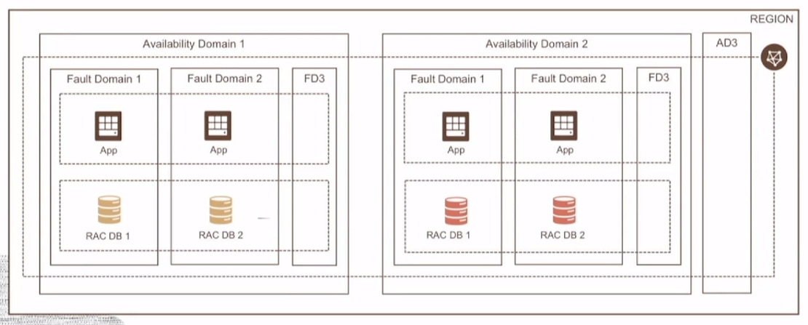

# Oracle Cloud Infrastructure Architecture

Core constructs of OCI's Physical Architecture:
- **Regions**: localized geographic area comprising of one or more Availability Domains. 
- **Availability Domains (AD)**: fault-tolerant data centers located within a region but connected to each other by a low latency, high bandwidth network.
- **Fault Domains (FD)**: grouping of hardware and infrastructure within an availability domain to provide antiaffinity (i.e. *logical data center*).

## How do you choose a Region ?

1. **Location**: the region closest to your users for lowest latency and highest performance.

2. **Data Residency & Compliance**: many countries have strict data residency requirements.

3. **Service Availability**: new cloud services are made available based on regional demand, at times regulatory compliance reasons, and resource availability, and several other factors.

## OCI Architeture

## High Availability Design

