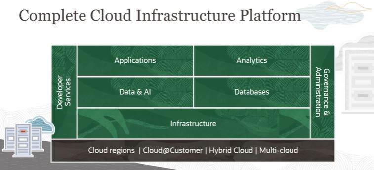

# Oracle Cloud Infrastructure Platform

**Oracle Cloud Infrastructure** building blocks:
- Core Infrastructure
	- Compute (Bare Metal, VM, CPUs, GPUs, HPC)
	- Containers
	- OS, VMware
	- Storage (Block, Object, Archive, etc.)
	- Networking (VCN, VPN, etc.)
- Database 
	- Oracle Databases (OLTP, OLAP, JSON, etc.)
	- Distributed & OSS Databases (NoSQL, MySQL)
- Data & AI 
	- Big Data (Data Flow, Data Integration, etc.)
	- AI services (Data Science)
	- Messaging (Streaming, Queueing)
- Analytics 
	- Business Analytics
- Applications 
	- Serverless (Events, Functions, API Gateway)
	- App Integration (Integration Cloud, etc.)
	- Business & Industry SaaS (ERP, HCM, SCM, Sales, etc.)
- Governance & Administration
	- Cloud Ops (IAM, Compartments, Tagging, Cost Advisor)
	- Security (Cloud Guard, Security, etc.)
	- Observability (Monitoring, Logging, etc.)
- Developer Services
	- Low Code (APEX)
	- AppDev (Visual Builder Studio, GraalVM, etc.)
	- Infrastructure as Code (Terraform, Ansible, etc.)

