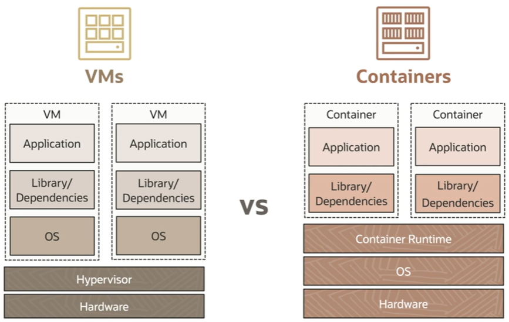
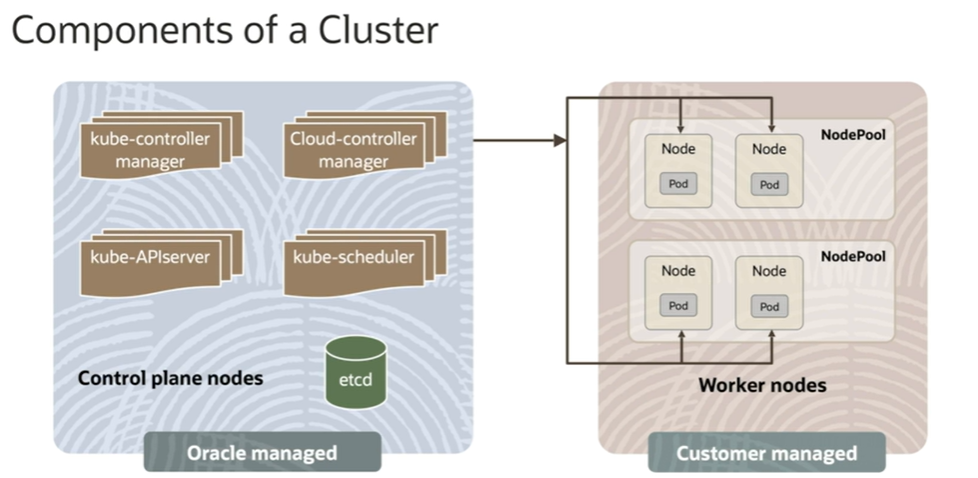
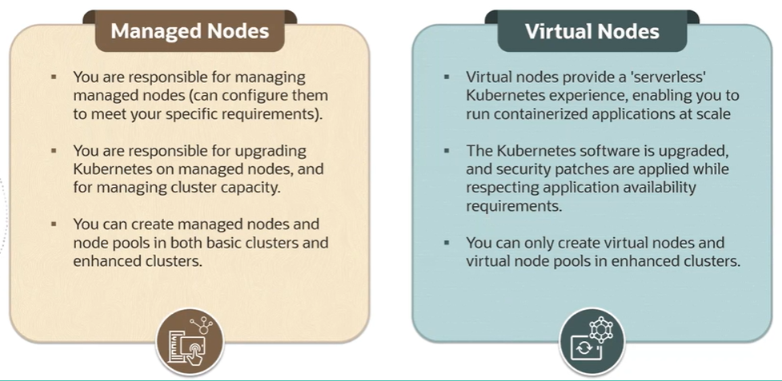

# Oracle Container Engine for Kubernetes (OKE)

VMs :
- higher utilization of the underlying resources
- higher disk space 
- longer boot time

Containers:
- faster boot time
- lightweight
- **portable** (main reason)

## Container Orchestration 

**Docker** is used to manage and build the containers.

**Kubernetes** is an open source system for automating deployment, scaling, and management of containerized application.

What are some of the advantages? 

1. you can run containerized applications of **any scale** with no downtime
2. you can **self-heal** applications, thereby providing resiliency
3. you can **auto-scale** containerized applications, ensure optimal utilization
4. greatly **simplifies deployment** to a large extent.

## OKE

**OKE** is a fully managed, scalable, and highly available Kubernetes service. It's based on the open source Kubernetes system. It has a lot of features for developers like one click cluster creation, CLI API support, and then support for running these on ARM-based and GPU-based instances.

When creating a new cluster with OKE, you can specify the type of cluster to create. So there are two types of clusters:
1. **enhanced clusters**: they support all available features and come with a financially backed SLA.
2. **basic clusters**: they support core functionality, but none of the enhanced features. They come with a financial  Service Level Objective (SLO), but not a financially backed SLA like the enhanced cluster. 

When creating a node pool for your Kubernetes cluster, you also have two options:

1. to create a **virtual node**: the Kubernetes software is upgraded, security patches are applied while respecting application availability requirements. But it's done by Oracle. You can only create virtual nodes and virtual node pools in enhanced clusters.
2. to create a **managed node**: you are responsible for managing the nodes, upgrading Kubernetes on managed nodes and for managing cluster capacity. And unlike virtual nodes, you can also create managed nodes in basic clusters, as well as enhanced clusters.

