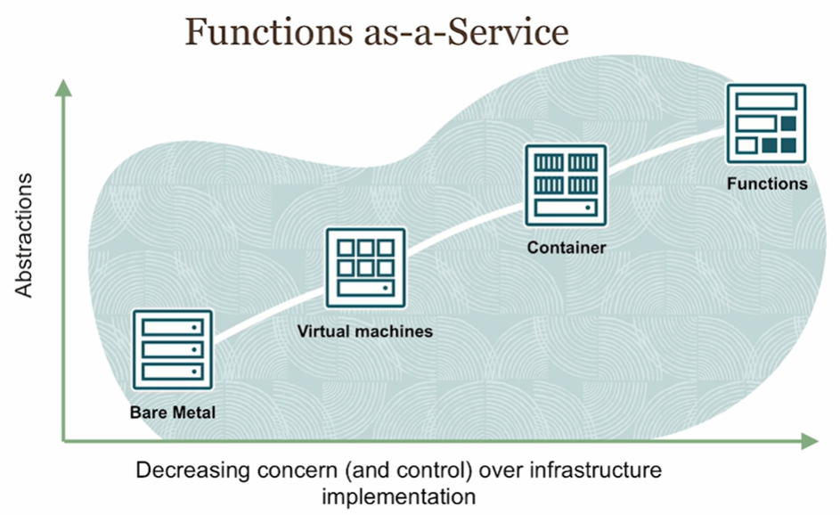
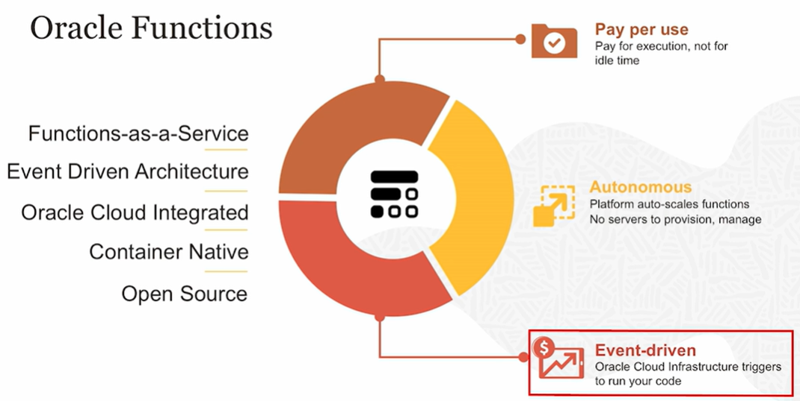
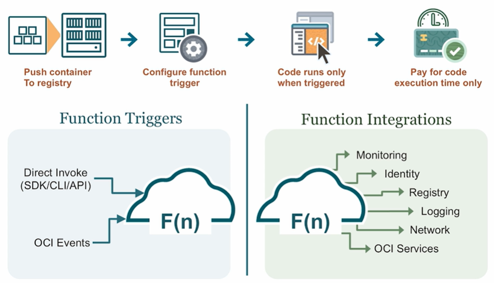

# Oracle Functions

One of the greatest advantages of FaaS is that it truly leads you to a *consumption based* pricing model where you are only billed for the time your function is running.

## Key Characteristics

Oracle Functions is powered by the **Fn Project** Open Source engine. So unlike some of the other cloud vendors out there, this particular service is built on the open source Fn engine.

## How does it work ?

