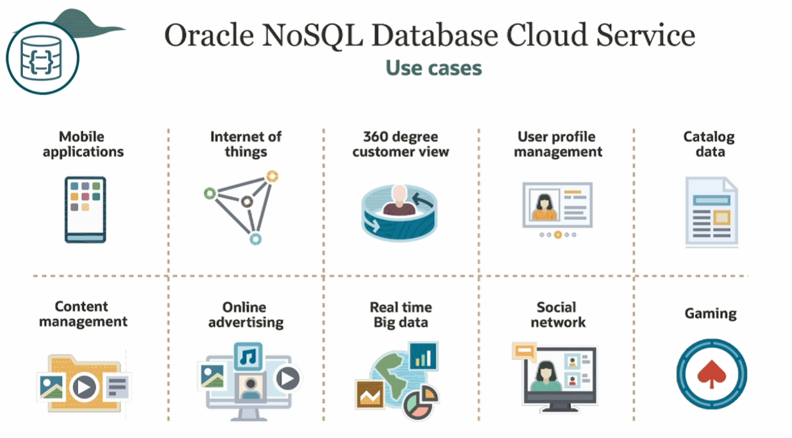

#  Oracle NoSQL Database Cloud Service

Defining characteristics:
- fully managed
- elastic (dynamically change throughput and storage capacities based on workloads)
- high performance
- data model flexibility (document, fixed-schema, key-value)
- access control
- low operating cost
- developer friendly
- always available
- hybrid cloud

