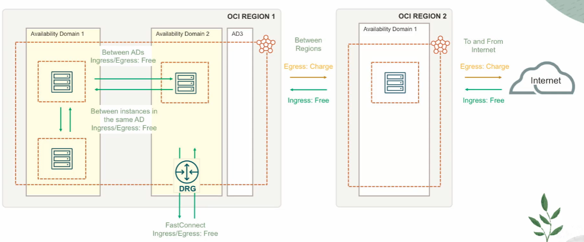

# Pricing

Oracle's pricing is simple, it's transparent, and it's lower than competitors. 

OCI has the same pricing across the world. This is very different than the typical traditional Cloud model where the pricing is very local. 

Factors that impacts pricing:
- resource size (bigger resources cost more)
- resource tipe (VMs vs BMs, VMs vs Functions, etc.)
- data transfer (no ingress cost, careful with egress cost)

**Pay As You Go (PAYG)** pricing model:
- charged only for the resource consumed
- no upfront commitment
- no minimum service period
- usage metered

**Annual (or Monthly) Universal Credits** pricing model:
- commit to ann annual pool of funds
- significant savings
- must use credits within 12 months
- discounts based on sise of deal and term of deal
- if you end up with more resource usage, then you pay for them on a PAYG basis

**Bring YOur Own License (BYOL)** pricing model:
- apply your current on-premises Oracle licenses to equivalent, higly automated IaaS & PaaS services in the cloud
- complte license mobility with on-premises

**Consumption Based** pricing model:
- charged only when you consume the resource
- ideal for managed serverless platform called **Functions**

## Data Transfer Costs

With OCI you don't really pay for any data transfer happening between Availability Domains. 

Incoming traffic is **free**, but outgoing traffic is **10 times lower** than some of the other Cloud providers. 

