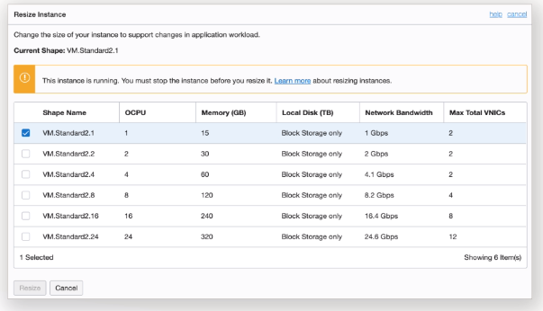
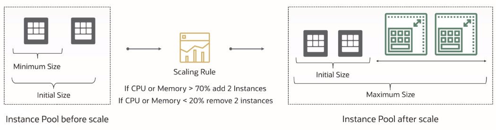

# Scaling

There are two kinds of scaling:
- vertical scaling
- horizontal scaling

## Vertical Scaling (scale up/down)

Vertical scaling means that you are scaling up or down instance shapes. 

New shape must have the **same hardware architecture**. 

When you scale up or scale down there is a **downtime required**.

Good practice: stop your instance before any kind vertical scaling.

## Horizontal Scaling (Autoscaling) (scale out/in)

Horizontal Scaling means that you add more VMs of the same shape, or you take a bit more of the same shape. This enables large-scale deployment of VMs.

Why is this so popular and powerful? The reason it is so powerful is, it gives you that scaling capability, but it also gives you that **high availability** And a thing which makes it really powerful is, you can match traffic demand by adding to removing VMs **automatically**. There is no extra cost for using Autoscaling.

There are three steps you have to follow to get Autoscaling:
1. create a **template** (config): OS image, matadata, shapes, cNICs, etc.
2. create an **instance pool**: a collection of instance in advance
3. create the **autoscaling rules**: minimum size, maximum size, etc.

Autoscaling in an instance pool within the OCI Compute service automatically provisions and removes instances based on specific conditions or schedules. It does not change the shape of the compute instance, nor is it limited to only metric-based or schedule-based autoscaling. Instead, autoscaling can be driven by both **metric-based** and **schedule-based** policies, offering a more dynamic and flexible scaling solution.

