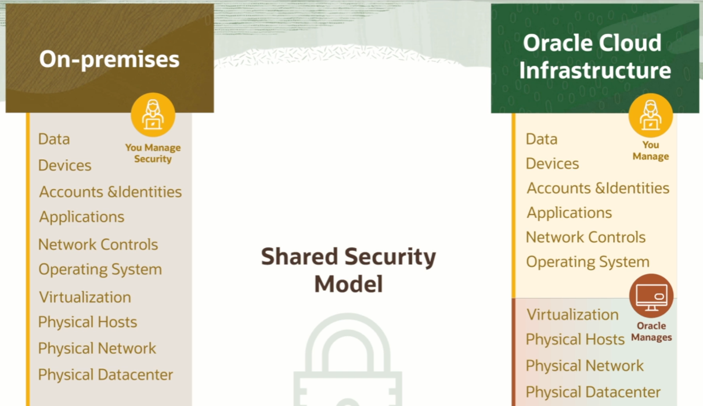
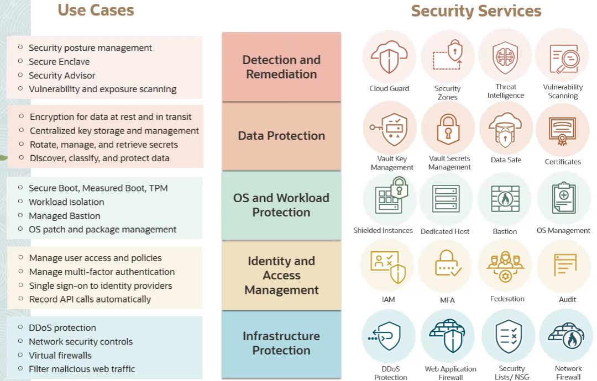

# Security Introduction

In an on-premises environment, you own the whole stack and you are responsible for security end-to-end. In a **shared security model** some of the responsibilities transfer to the Cloud provider.

In the OCI shared security responsibility model, Oracle is responsible for securing the underlying cloud infrastructure. This includes securing the physical data centers, network infrastructure, and hardware that support the cloud services, ensuring a secure and reliable environment for customers to deploy their applications and store data.

 In the OCI shared security responsibility model, the customer is responsible for securing their data, applications, and access control. This includes implementing appropriate security measures such as encryption, user access control, and monitoring to protect sensitive data and ensure the overall security of their cloud environment.

## Security Services

Security is not just one service or an add-on. 

Security is enforced at different layers of the stack:
- infrastracture protection
- identity and access management
- OS and workload protection
- data protection
- detection and remediation

