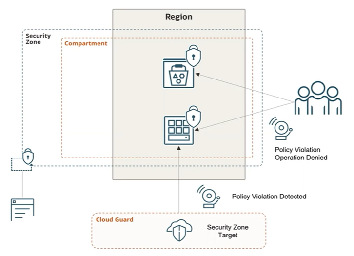

#  Security Zones & Security Advisor

Security Zone refers to a cloud compartment in which you cannot disable security. 

Security Advisor refers to a cloud service that unifies Security Zone, Cloud Guard, and some other capabilities together in a cohesive whole.

## Security Zones

In terms of functional usage, **Security Zones** and a **Security Zone Recipe** can be classified as **Preventive Counter Measures**.

When you create a Security Zone, you select one or more compartments and a recipe. A Security Zone Recipe specifies which policies you want to enforce. Oracle provides a default set of policies, but you can create your own policies.

Any attempt to create or modify resources in the security zone that violates one of the zone's policies is denied. Security Zone uses Cloud Guard, as you can see in the diagram here, to routinely scan your zones and report any zone policy violation. 

NOTE: you must enable Cloud Guard before you can use Security Zones. 

The main advantage of using OCI Security Zones when deploying resources in your cloud environment is to ensure adherence to security best practices and policies. Security Zones help maintain a strong security posture by automatically enforcing predefined security policies within designated compartments, preventing the creation of non-compliant resources.

## Security Advisor

Security advisor is a combination service that takes the functionality that's provided by Cloud Guard and Security Zone as well as some of the other security services and bring them together.

