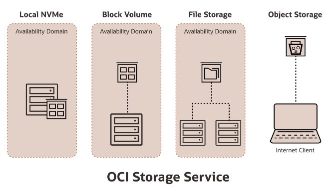

# Storage Introduction

Storage requirements:
- persistent VS non-persistent
- what type of data (databases, texts, videos, photos)
- performance (capacity, IOPS, throughput)
- durability (# of copies)
- connectivity (local storage, network storage, how to access data)
- protocol (block, file, http)

## OCI Storage Services

1. **Local NVMe**: locally-attached storage. And you could run your most performance-sensitive applications using local NVMe. 

2. **Block Volume**: a compute instance talking to a storage server on the network. The advantage is that the storage can be truly persistent and durable and extend beyond the lifetime of the instance itself. The data is managed as **fixed-sized** blocks. You create a partition, you create a file system, then you mount the file system.

3. **File Storage**: similar to block volume, but it's a **shared** file storage system and you manage the storage as files and directories. You don't partition the disk. You still do some of the things like you mount the file system.

4. **Object Storage**: this is a kind of storage you would use for photos, videos, log files, text file, any kind of files you store on the **web**. Typically, the way it is accessed is you have an internet client, who accesses this particular objects using simple and familiar HTTP verbs, like PUT and GET.

Along with these storage services, there are several data migration services:
- **Data Transfer Disk**: you send us your disks, and Oracle migrate the data
- **Data Transfer Appliance**: you send a much large applicance, and Oracle migrate the data
- **Storage Gateway**: a linux appliance that sits in your data center, and using that, you can migrate data to OCI.

