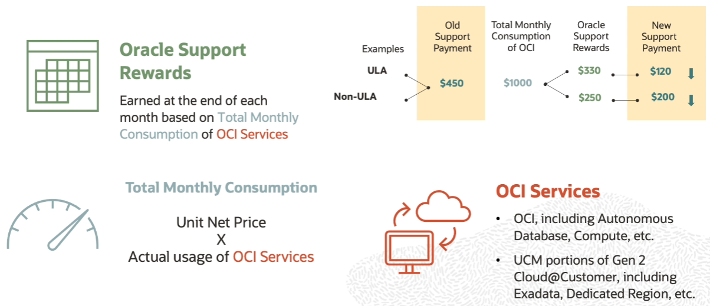

# Oracle Support Rewards

Oracle Support Rewards is a program that provides additional value to Oracle's on-premises customers who also consume OCI services. 

So based on their consumption of OCI services, customers can earn Support Rewards that are then applied as a form of payment for their software update licenses and support for Oracle technology programs.

More OCI services, you can decrease your on-premises support cost.

