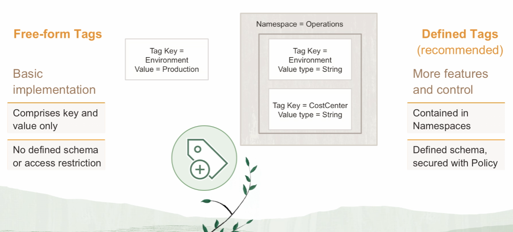
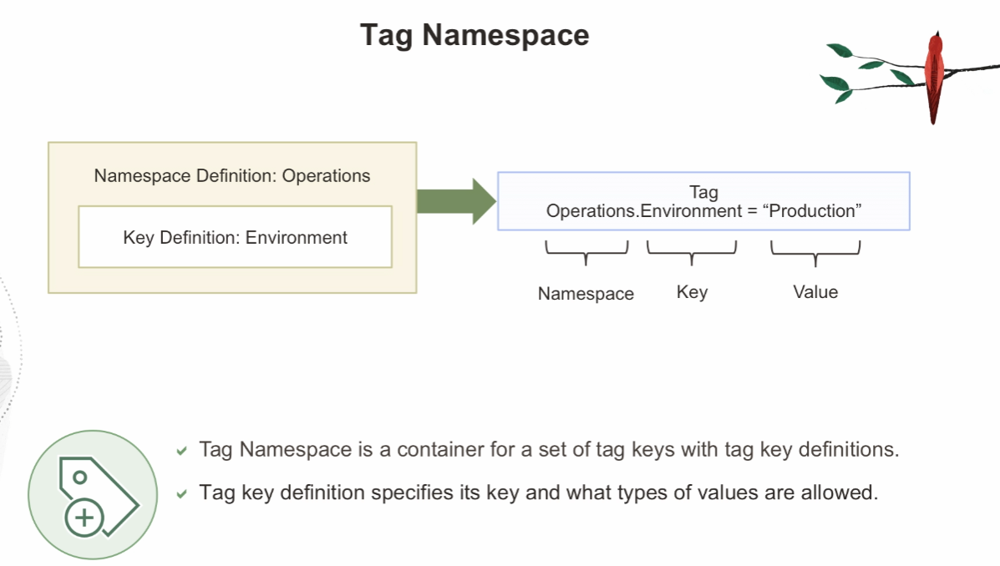

# Tagging

Tags are basically these key value pairs, which you could use to better organize your resources. 

Tags allows you to:
- customizze the organization of your resources
- cost management
- tag based access control (ability to write policies based on *tags*)

In OCI, there are two kinds of tag:
1. free-form tags
2. defined tags (recommended)

## Free-Form Tags

Characteristic:
- basic implementation
- comprises key and value only
- no defined schema or access restriction

Example:

	Environment = "Production"

## Defined Tags (recommended)

Characteristic:
- more feeatures and control
- contained in namespaces
- defined schema
- secured with policy

Example:

	Operations.Environment = "Production"

You could also specify the type of values allowed. You could say the type is a *String* and it allows any value, or it is blank. Or you could set a specific set of values and when the users come to apply this particular tag, they can only choose from those particular values.

