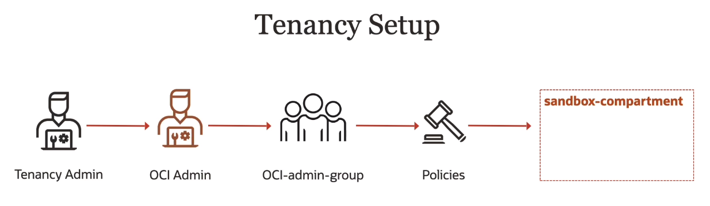

# Tenancy Setup

A tenancy administrator is the person who creates an account and is kind of responsible for day to day operations of this account. But a best practice is to not have tenancy administrator do kind of day to day operations, but rather have somebody who is an admin for your particular account. And this can be a set of users, not just one person.

## Best Practices

1. Don't use the tenancy administrator account for day-to-day operations
2. Create dedicated comparments to isolate resources (e.g. production vs development)
3. Enforce the use of Multi-Factor Authentication (MFA)

