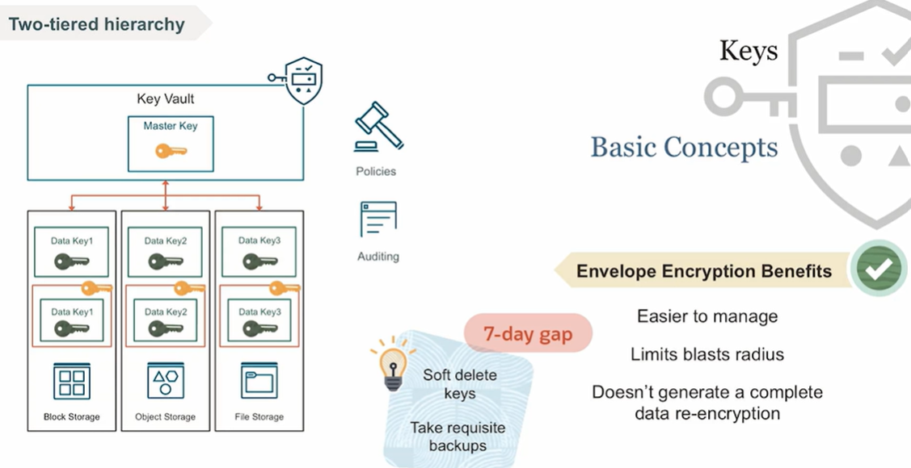
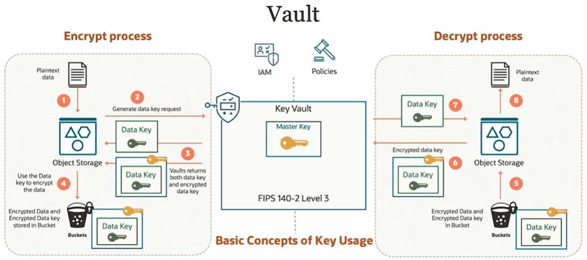

#  Oracle Vault

OCI Vault is a managed service that lets you centrally manage encryption keys and secret credentials. Vault removes the need to store encryption keys and secrets in configuration files or in code. The service is a regional service and it has a public API endpoint that you can use.

Secrets are credentials such as passwords, certificates, SSH-keys, or authentication tokens that you can use with Oracle Cloud Infrastructure services.

The primary purpose of the OCI Vault service is to store and manage encryption keys and secrets. The Vault service helps you to securely store, manage, and control access to encryption keys, secrets, and certificates, ensuring the protection of sensitive data.

OCI Vault is composed of various components including master encryption keys, secrets, and vaults. A vault in OCI is a logical entity where you can centrally manage and store your encryption keys and secrets. A secret is a resource that helps manage credentials needed to access OCI resources. A master encryption key is a key that OCI uses to encrypt the encryption keys that you create in the vault (these are customer managed). Database backup is not a component of OCI Vault; it is a functionality associated with the OCI Database service.

## Envelop Encryption

The way the Vault operates is called **envelop encryption**. It is a two tiered hierarchy for keys:
- Tier-1: the **data encryption keys** encrypt customer data
- Tier-2: the **master encryption keys** encrypt the data keys

So you can see on the picture here, there is the master key that is used to encrypt the data key. And so you see that out of the middle box where the data is encrypted by the master key, but the actual encryption for storage, let's say, it's block storage or object storage or file storage, is actually done using the data key.

You can use IM policies to authorize access to master keys  and audit logs to monitor all key related activities.

What are the benefits? 
- it is easier to manage
- it limits the blast radius
- it does not generate a complete data re-encryption

**IMPORTANT**: If the master key is deleted, then **there is no way for anyone to recover the data!** 

OCI soft delete the keys with a seven day gap. Vault cannot be deleted immediately. You can schedule the deletion by configuring a waiting period. The Vault and all the keys created inside the Vault are deleted at the end of this waiting period. And all the data that was protected by those keys is no longer accessible after the Vault is deleted. So that's why that 7 to 30 day period is there by design. 

**IMPORTANT**: once the Vault is deleted, it cannot be recovered!

