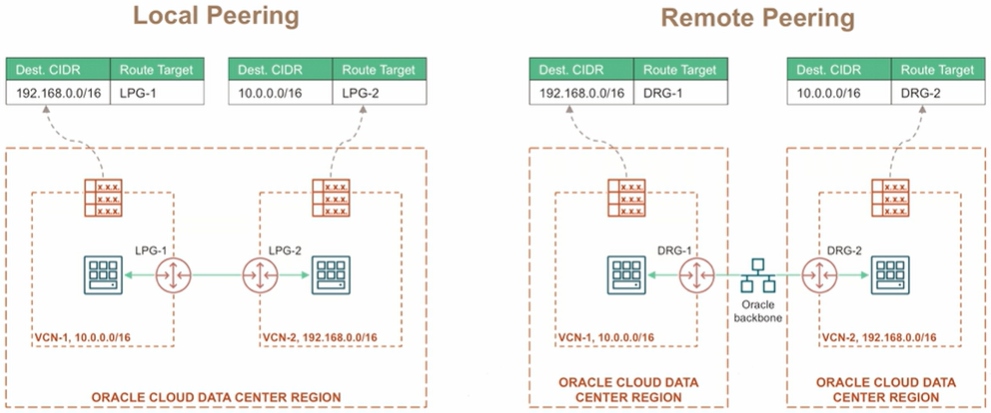
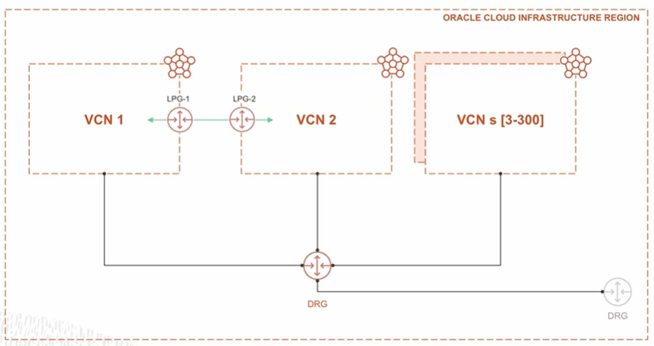

# VCN Routing

VCN uses **Route Tables** to send traffic out of the VCN to the internet, to on-premises networks, or to peered VCN.

Route tables consist of a set of route rules. Each rule specifies a destination CIDR block and a route target (the next hop for the traffic that matches that destination CIDR block).

One thing to keep in mind is traffic within the VCN subnet is automatically handled by the VCN local routing. There's no entry in a route table needed for routing that data between the public subnet and the private subnet.

When you create a VCN, a default route table, security list, and DHCP options are created automatically, but a Local Peering Gateway (LPG) is not created by default. LPGs are used to connect two VCNs in the same region.

## VCN Peering

VCN peering is not a VPN-based connection; instead, it is a networking connection between two VCNs that enables traffic routing between the VCNs using private IP addresses. Peer VCNs must not have overlapping CIDRs. VCNs can be peered in the same region or different regions through a DRG.

If you have multiple networks, how do they talk to each other? 

1. Local Peering (same region)
2. Remote Peering (different regions)

## Dynamic Routing Gateway v2

What happens if you have hundreds of VCNs?

