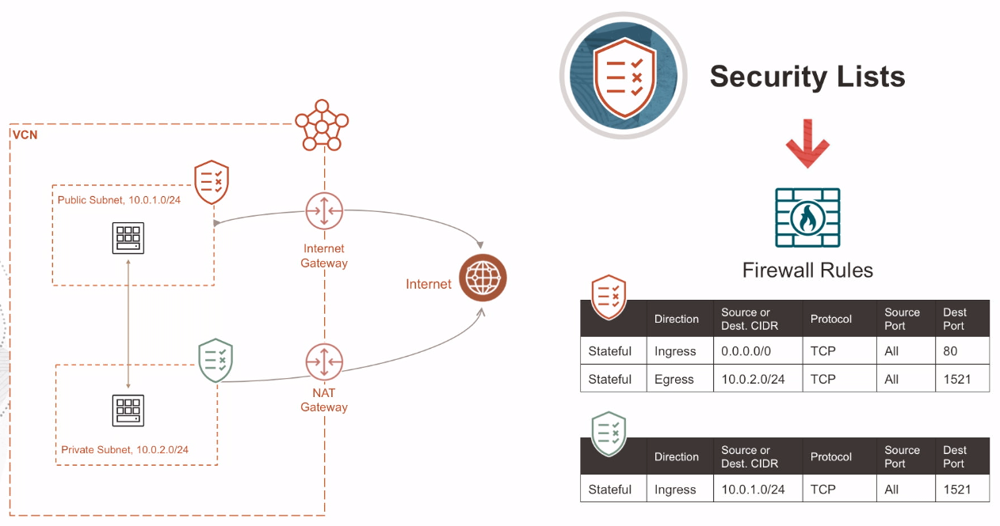
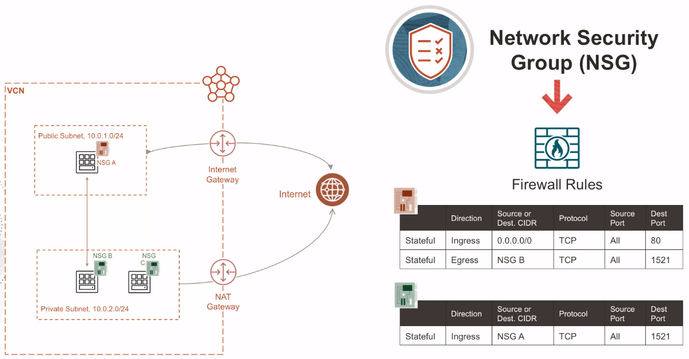

# VCN Security

A **Security List** is a sort of firewall rules associated with a subnet and applied to all instances inside the subnet. The Security List consists of rules that specify the type of traffic allowed in or out of the subnet. This applies to a given instance, whether it is talking with another instance in the VCN or a host outside the VCN.

*Security List = A set of firewall rules that apply to all resources in a subnet.*

A **Network Security Groups** (NSG) is a very similar construct as Security List, but the key difference is that apply only to a set of virtual network interface cards in a single VCN. And another big difference is that a NSG can be the source or destination in the rules. 

*Network Security Group = A set of firewall rules that apply to any set of resources in a VCN that you specify.*

