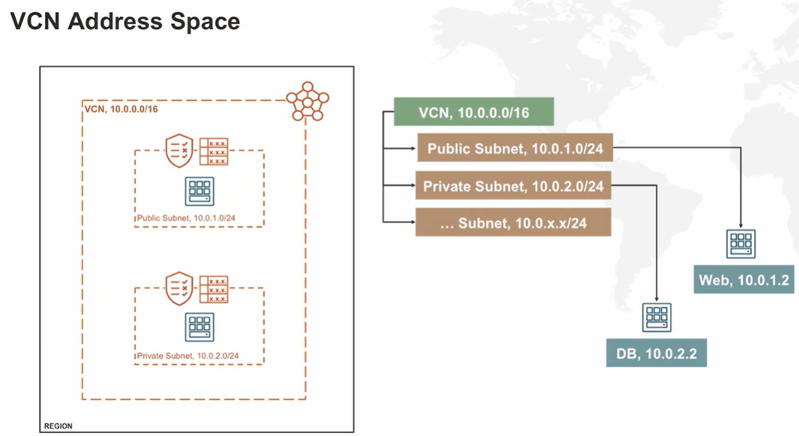
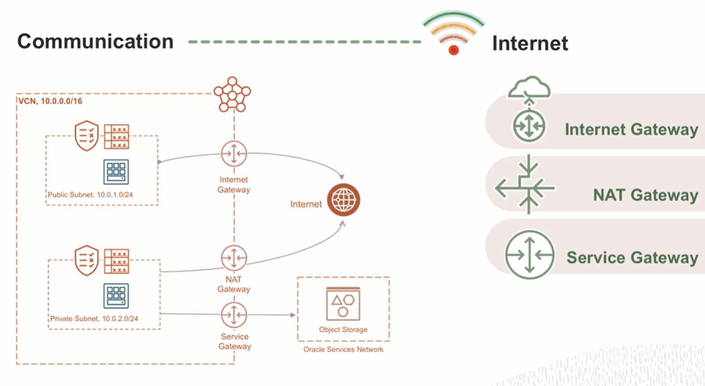
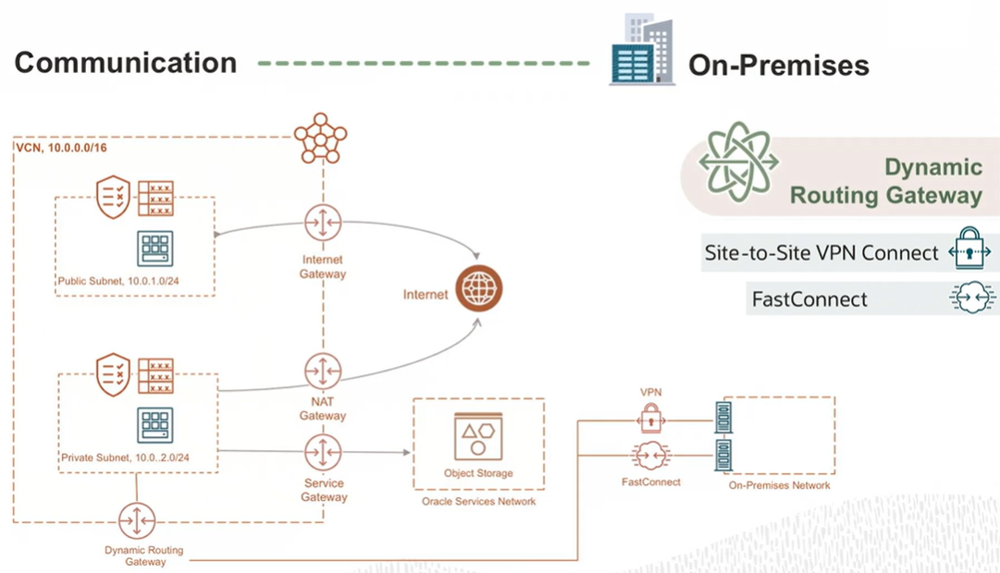

# Virtual Cloud Network

A **Virtual Cloud Network** (VCN) is a private software defined network in Oracle Cloud. It's used for secure communication. It lives in an OCI region.

## VCN Address Space

VCN has an **address space** (IP addressing range). You take that range and break it down into smaller networks which are called *subnetworks*. And these subnetworks are where you would instantiate your compute instances.

## VCN Communications

What different mechanisms exist inside a VCN ?

1. **Internet Gateway**: two-way communication between a VCN and the internet.
2. **NAT Gateway**: one-way communication from a VCN to the internet.
3. **Service Gateway**: access from a VCN to public Oracle services.
4. **Dynamic Router Gateway**: access from a VCN to destinations others than the internet.

